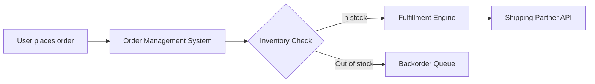

# /prd-draft

## Invocation
`/prd-draft <idea or problem description>`

## Goal
Convert a product idea into a complete, illustrative PRD that anyone can understand — regardless of their technical depth. The PRD should make a complex system feel simple.

## First step: classify the feature type
Before drafting, ask the user (or infer from context) which type this is:

| Type | What changes in the PRD |
|---|---|
| **New feature** | Emphasize user stories, prototype, metrics |
| **Net-new product** | Add market context, competitive positioning, go-to-market considerations |
| **Complex system change** | Heavy emphasis on dependency matrix, system diagrams, blast radius |
| **ML/AI/Intelligence layer** | Add model selection rationale, training data needs, eval criteria, fallback behavior |
| **Internal tool** | Simplify metrics (efficiency gains), skip competitive context, focus on workflow before/after |

The feature type shapes the emphasis, not the structure. All 9 sections appear in every PRD.

## Output: 9-section PRD

### Section 1: Problem Statement
Use simple, descriptive sub-headers (e.g., "The pain point," "Who is affected," "Why now") — NOT question-style headers like "What's the pain?" or "Who feels it?". The PRD should read like a document, not a FAQ.

Cover:
- The core pain point
- Specific roles or user segments who feel it (never generic "users")
- Severity signals: frequency, ticket volume, time wasted, revenue lost
- Why this is worth solving right now — what changed

Write in plain language. A new hire should understand the problem after reading this section once.

### Section 2: Impact & Stakeholders
Use simple sub-headers. Cover:
- Teams affected and how they benefit
- Teams that might be disrupted (especially for complex system changes)
- Estimated reach (users, transactions, revenue)

### Section 3: Solution Overview
- One-paragraph plain-language description of what we're building
- Process flow as a **Mermaid diagram** showing the happy path
- System diagram as a **Mermaid diagram** showing which systems are involved and how data flows between them
- For complex system changes: show the CURRENT state diagram AND the PROPOSED state diagram side by side

Mermaid format example:

### Section 4: Solution Deep Dive — User Stories
- 4-6 user stories in the format: "As a [specific role], I want [action] so that [outcome]"
- Include at least one edge case story (what happens when things go wrong)
- Include at least one story for internal users if the feature touches internal systems
- Each story should be concrete enough that an engineer can estimate it

### Section 5: Dependency Matrix
- Table format showing every system, team, and external dependency

| System / Team | What they own | What changes for them | Dependency type | Risk level |
|---|---|---|---|---|
| [e.g., Inventory Service] | [Real-time stock levels] | [New API endpoint needed] | Blocking | High |

- Mark each dependency as: **Blocking** (can't ship without it), **Enhancing** (better with it, can ship without), or **Informational** (just needs to know)
- Flag any dependency where you're NOT SURE if it's affected — these are the ones to validate with engineering
- For complex system changes: this section is the most important one. Be thorough. List systems you think MIGHT be affected even if you're unsure.

### Section 6: Success Metrics & Guardrails
- 2-4 success metrics, each with: what we're measuring, current baseline, target, timeframe
- At least one leading indicator (can measure within days, not weeks)
- 1-2 guardrail metrics: things that should NOT get worse (e.g., latency, error rate, support tickets)
- For ML/AI features: include model performance metrics (precision, recall, etc.)

### Section 7: Ramp-Up Plan
- **Pilot phase**: who, what scope, how long, what we're learning, kill criteria
- **Expansion phase**: how we grow from pilot, what triggers expansion
- **Full rollout**: what "done" looks like
- Include a simple timeline (even if rough)

### Section 8: Working Prototype
- ALWAYS generate a React component that visualizes the feature
- For user-facing features: build the actual UI the user would see
- For backend/API changes: build a dashboard or visualization showing the data flow, system states, or monitoring view an engineer would use
- For ML/AI features: build a prototype showing inputs, model output, and confidence scores
- The prototype should be functional enough to demo to stakeholders — not just wireframes

### Section 9: Open Questions & Risks
- Unresolved questions with proposed owners
- Top 3 risks with mitigation ideas
- Anything flagged as uncertain in the dependency matrix

## Writing style
- Simple language. No jargon unless defining it first.
- Short sentences. Short paragraphs.
- **Section headers must be simple and descriptive** — never phrased as questions. Use "The pain point" not "What's the pain?" Use "Affected teams" not "Who is disrupted?" The PRD is a document, not a FAQ.
- Show, don't tell. Use diagrams, tables, and the prototype instead of long descriptions.
- Active voice. "We will build X" not "X will be built."
- Every section should be understandable by someone seeing the system for the first time.

## Process
1. Classify the feature type
2. Read context-library/ to ground the PRD in the user's company and systems
3. Draft all 9 sections
4. Generate Mermaid diagrams for section 3
5. Generate the React prototype for section 8
6. Run validator.md against the complete draft
7. Present the PRD + validator report
